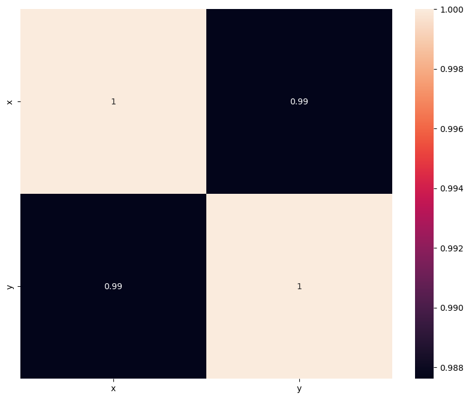
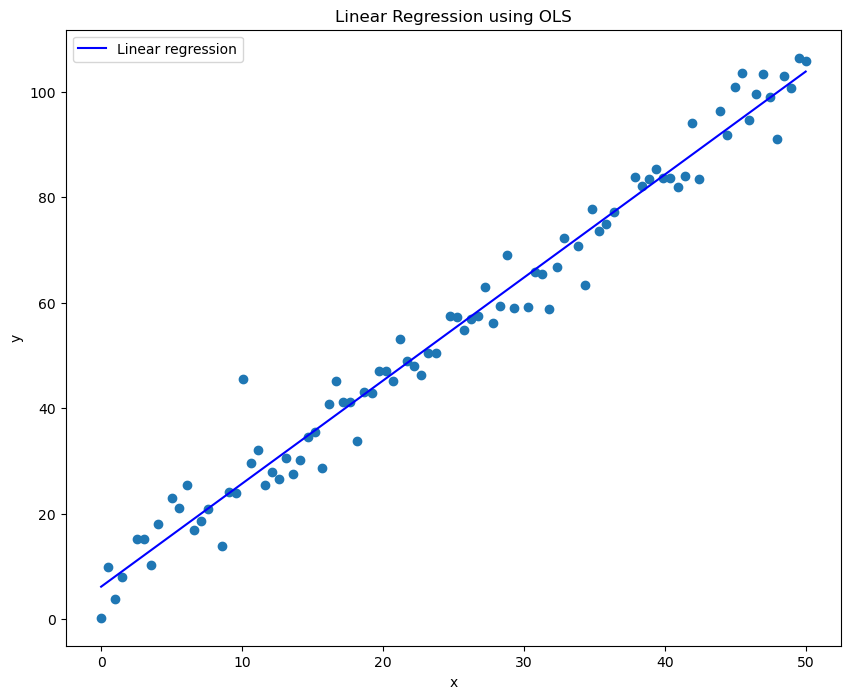
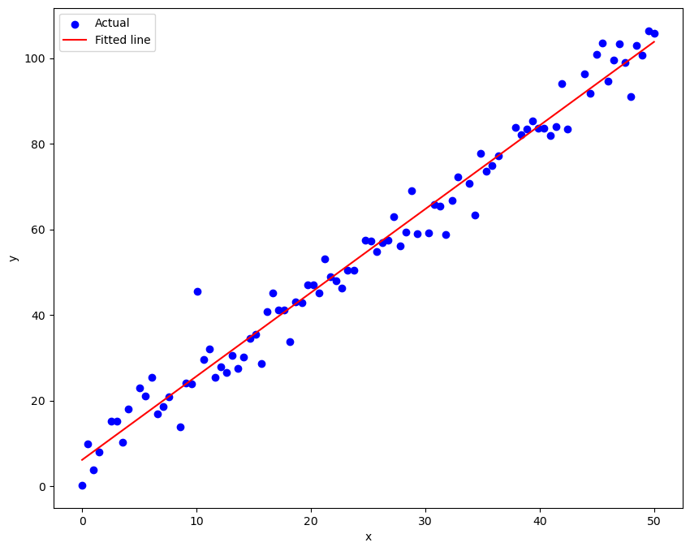

# Linear Regression Analysis 📊 &nbsp; [](Linear%20regression%20F.ipynb)


> **Implementing linear regression from scratch and validating with Scikit-learn and SciPy — achieving R² = 0.975 on a dataset with strong linear correlation (r = 0.99).**

<br>

<p align="center">
  
  &nbsp;&nbsp;
  
  &nbsp;&nbsp;
  
</p>

<br>

## Table of Contents

- [Problem Statement](#problem-statement)
- [Dataset](#dataset)
- [Methodology](#methodology)
- [Key Results](#key-results)
- [Visualizations](#visualizations)
- [Technologies Used](#technologies-used)
- [How to Run](#how-to-run)
- [Author](#author)

<br>

## Problem Statement

How do we model the relationship between two continuous variables, and how do different implementations of Ordinary Least Squares (OLS) compare? This project implements **linear regression three ways** — manually from scratch using NumPy, with Scikit-learn, and with SciPy — then compares results to demonstrate that all approaches yield identical coefficients. The project also covers data cleaning, missing value analysis, and correlation diagnostics.

<br>

## Dataset

| Property | Detail |
|----------|--------|
| **Source** | University assignment (DM954) |
| **Original Size** | 100 observations, 2 features (x, y) |
| **Cleaned Size** | 90 observations (10 missing y values removed) |
| **Features** | `x` (continuous), `y` (continuous, target) |
| **Missing Values** | 10 NaN values in y — analyzed for dependency on x, handled via listwise deletion |

<br>

## Methodology

### 1. Exploratory Data Analysis
- **Box plots** for outlier detection in both x and y
- **Scatter plots** to visually assess linearity
- **Histograms** for distribution analysis
- **Missing value analysis** — tested whether NaN values in y depend on x values

### 2. Data Cleaning
- Removed 10 rows with missing y values (listwise deletion)
- Exported cleaned data to `treated_set.dat`

### 3. Correlation Analysis
- Computed Pearson correlation matrix
- Visualized with heatmap — **r = 0.99** confirming strong linear relationship

<p align="center">
  
</p>

### 4. Linear Regression — Three Approaches

**Approach 1: Manual OLS (NumPy)**
```python
b = np.sum((x - x_mean) * (y - y_mean)) / np.sum((x - x_mean)**2)
a = y_mean - b * x_mean
# Result: slope = 1.9537, intercept = 6.1268
```

**Approach 2: Scikit-learn**
```python
model = LinearRegression()
model.fit(X, y)
# Identical: slope = 1.9537, intercept = 6.1268
```

**Approach 3: SciPy**
```python
slope, intercept, r_value, p_value, std_err = stats.linregress(x, y)
# Identical: slope = 1.9537, intercept = 6.1268, p-value = 1.40e-72
```

### 5. Model Evaluation
- Manually computed R² from SS_res and SS_tot
```python
R2_manual = 1 - (SS_res / SS_tot)  # R² = 0.9754
```

<br>

## Key Results

| Metric | Value |
|--------|-------|
| **Pearson Correlation (r)** | **0.99** |
| **R-squared (R²)** | **0.975** |
| **Slope (b)** | 1.9537 |
| **Intercept (a)** | 6.1268 |
| **p-value** | 1.40 × 10⁻⁷² |
| **Standard Error** | 0.0331 |

All three OLS implementations produced **identical coefficients**, confirming mathematical equivalence of manual calculation, Scikit-learn, and SciPy approaches.

<br>

## Visualizations

### Linear Regression Fit (OLS)
<p align="center">
  
</p>

### Actual vs Fitted Values
<p align="center">
  
</p>

<br>

## Technologies Used

| Tool | Purpose |
|------|---------|
| Python 3.x | Core language |
| Pandas | Data loading & manipulation |
| NumPy | Manual OLS calculations |
| Seaborn | Heatmap & statistical plots |
| Matplotlib | Scatter plots & regression lines |
| SciPy | Statistical regression & p-values |
| Scikit-learn | LinearRegression model |

<br>

## How to Run

```bash
# Clone the repository
git clone https://github.com/ouyale/Machine-Learning-Linear-Regression.git
cd Machine-Learning-Linear-Regression

# Install dependencies
pip install pandas numpy scikit-learn scipy matplotlib seaborn jupyter

# Launch the notebook
jupyter notebook "Linear regression F.ipynb"
```

<br>

## Author

**Barbara Obayi** — Machine Learning Engineer

[](https://github.com/ouyale)
[](https://www.linkedin.com/in/barbara-weroba-obayi31/)
[](https://ouyale.github.io)

---
